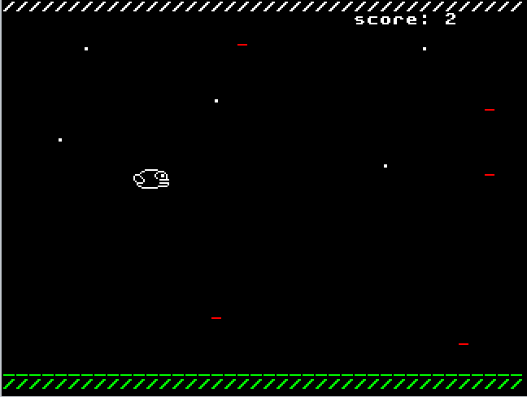
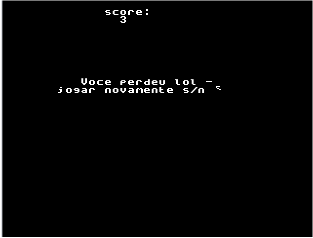
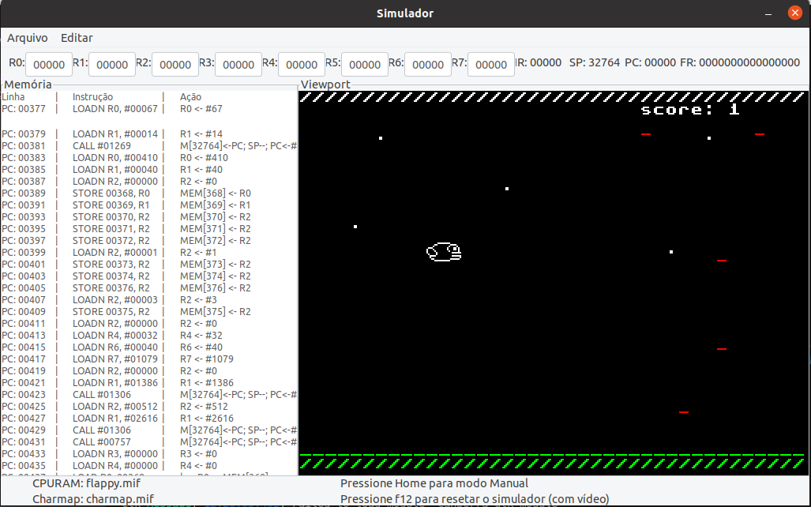

# FlappyBirdAssembly
Trabalho para a disciplina SSC0119 - Prática em Organização de Computadores

---
## Como executar?

Clone esse projeto em seu computador usando o comando:

`git clone https://github.com/gp2112/FlappyBirdAssembly.git`

Abra a pasta pelo terminal e execute:

`./montador flappy.asm flappy.mif`

para compilar o jogo.

Utilize o comando abaixo para executar:

`./sim flappy.mif charmap.mif`

> Observação: o procedimento acima funciona apenas para sistemas operacionais Linux - Ubuntu, caso deseje executar em outros sistemas operacionais é necessário instalar um simulador adequado [clicando aqui.](https://github.com/simoesusp/Processador-ICMC/tree/master/Simple_Simulator)
---
## Jogo Flappy Bird

Você é um pássaro e precisa voar e desviar dos tiros!

Jogo:

Game Over:

Execução no simulador:

---
## Modificação na CPU:

Adicionado comando RAND, que, através do registrador regRand, retorna ao resgistrado (Rx) o valor "aleatório"

RAND Rx

